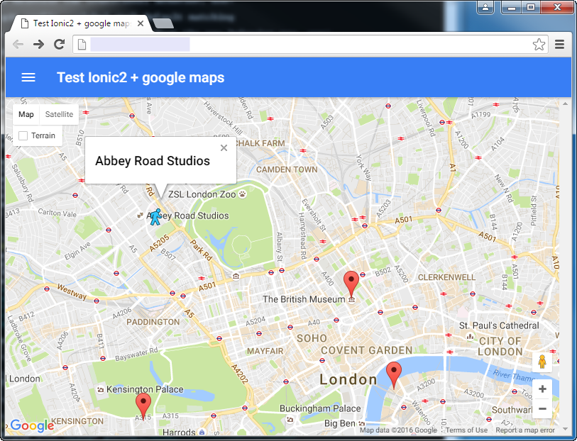

# ionic2-maps-demo
Ionic 2 + google maps API

Based on https://github.com/driftyco/ionic-conference-app

## Getting Started

1. git clone https://github.com/realfreebird/ionic2-maps-demo.git
2. cd ionic2-maps-demo
3. npm i
4. ionic serve

## App Preview

